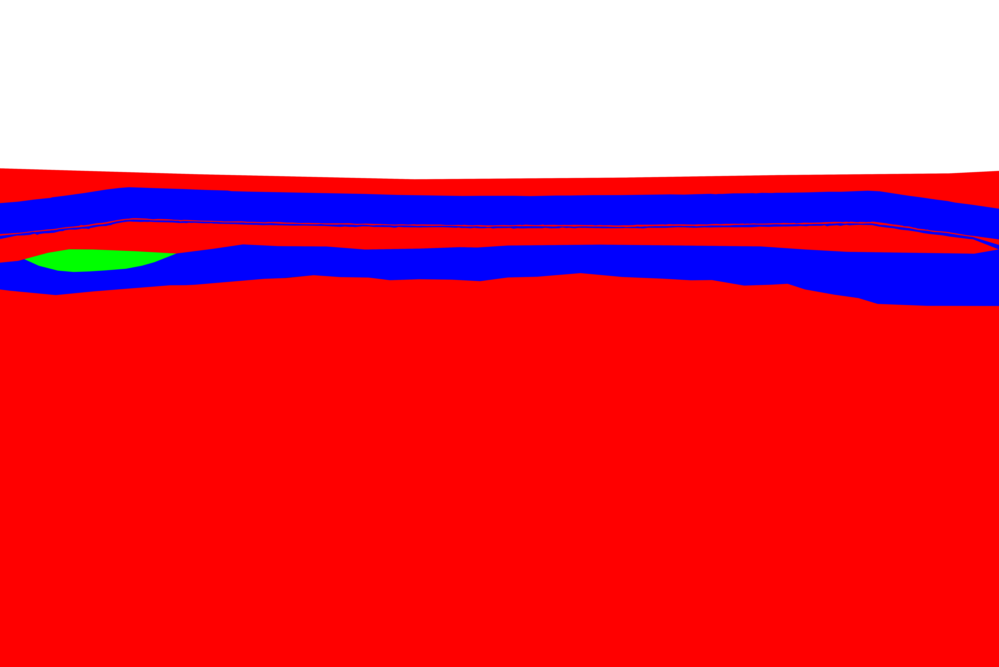

# 🔬 FluidFlower Glass Beads Project

> **A comprehensive interface to DarSIA analysis for the FluidFlower glass beads experiments (2025-2026)**

This repository serves as both an **operational workflow** and **learning material** for performing CO₂-water multiphase flow analysis on FluidFlower glass bead experiments using the [DarSIA](https://github.com/darsiaproject/darsia) framework.

---

## 📋 Quick Navigation

### 🚀 Getting Started
- **[Introduction & Workflow](introduction.md)** - Overview of the complete analysis workflow and quick setup guide
- **[Analysis Overview](analysis.md)** - Detailed guide to data processing and analysis steps

### ⚙️ Configuration Guides
- **[Image Selection Methods](image_selection.md)** - Learn 3 ways to select calibration/analysis images
  - Time intervals with equidistant sampling
  - Specific time points
  - Direct file path selection with wildcards
  
- **[Finger Analysis Setup](finger_analysis.md)** - Configure fingering instability detection
  - Understanding modes (concentration, saturation)
  - Defining regions of interest (ROIs)
  - Practical configuration examples

### 🛠️ Utilities
- **[setup_imaging_protocol.py](utils/setup_imaging_protocol.py)** - Extract EXIF timestamps from image files
  - Generates CSV correlation between images and acquisition times
  - Essential for protocol setup
  
- **[download.py](utils/download.py)** - Copy selected images from network to local storage

---

## 📊 Sample Analysis

Example segmentation result showing CO₂ phases in the FluidFlower:



*The image shows the facies segmentation of the glass bead geometry with different colored regions representing different sand layers.*

---

## 🏗️ Project Structure

```
├── README.md                          # This file
├── introduction.md                    # Workflow overview & getting started
├── analysis.md                        # Analysis steps & post-processing
├── image_selection.md                 # Image selection methods documentation
├── finger_analysis.md                 # Fingering analysis configuration
├── LICENSE                            # MIT License
│
├── config_example/                    # Example configuration files
│   ├── single/                        # Single-run configurations
│   │   ├── common.toml               # Common settings across runs
│   │   ├── analysis.toml             # Analysis configuration
│   │   └── ...
│   ├── run/                          # Run-specific configurations
│   │   ├── run_exp_1.toml
│   │   └── run_exp_4_flush.toml
│   └── multi/                        # Multi-run analysis configurations
│
├── data/                              # Data files and resources
│   ├── protocol_050825.xlsx           # Imaging/injection/pressure protocols
│   ├── facies.xlsx                    # Facies properties
│   ├── depth_measurements.csv         # Depth measurements
│   ├── refined_segmented_DSC00160_a.png  # Reference segmentation
│   └── ...
│
├── scripts/                           # Main analysis scripts
│   ├── setup.py                       # Geometry setup and calibration
│   ├── calibration.py                 # Color path calibration
│   ├── analysis.py                    # Image analysis pipeline
│   ├── post_analysis.py               # Post-processing & integration
│   └── comparison.py                  # Inter-run comparisons
│
└── utils/                             # Utility scripts
    ├── setup_imaging_protocol.py      # EXIF extraction tool
    └── download.py                    # Image download utility
```

---

## 🎯 Typical Workflow

### 1️⃣ **Setup Phase**
Prepare geometry and baseline calibration:
```bash
python scripts/setup.py --all --config config_example/single/common.toml config_example/run/run_050825.toml --show
```

### 2️⃣ **Calibration Phase**
Calibrate color-to-CO₂ conversion:
```bash
python scripts/calibration.py --color-paths --config config_example/single/common.toml config_example/run/run_050825.toml
python scripts/calibration.py --mass --config config_example/single/common.toml config_example/run/run_050825.toml
```

### 3️⃣ **Analysis Phase**
Analyze experimental data:
```bash
python scripts/analysis.py --all --config config_example/single/common.toml config_example/run/run_050825.toml config_example/single/analysis.toml
```

### 4️⃣ **Post-Analysis**
Extract integrated quantities and visualizations:
```bash
python scripts/post_analysis.py --config config_example/single/common.toml config_example/run/run_050825.toml config_example/single/analysis.toml
```

---

## 📚 Learning Path

**New to DarSIA or FluidFlower analysis?** Follow this sequence:

1. 📖 Read [introduction.md](introduction.md) for workflow overview
2. 🔧 Explore [image_selection.md](image_selection.md) to understand configuration options
3. 📊 Learn [analysis.md](analysis.md) for available analysis tools
4. 🌊 Check [finger_analysis.md](finger_analysis.md) for fingering instability studies
5. 🚀 Run example configurations from `config_example/`

---

## 🔧 Prerequisites

- **Python 3.9+**
- **DarSIA** - Install via: `pip install darsia`
- **Image data** - Raw JPG images from FluidFlower experiments
- **Protocol files** - Excel spreadsheets with timing/injection/pressure data

For detailed setup instructions, see [introduction.md](introduction.md#getting-started).

---

## 📋 Configuration System

This project uses a **modular TOML configuration system**:

- **`common.toml`** - Shared settings (rig geometry, depth, labeling)
- **`run_XXX.toml`** - Run-specific data (image folder, baseline, protocols)
- **`analysis.toml`** - Analysis settings (image selection, segmentation, mass ROIs)

Learn how to customize configurations:
- [Image Selection Methods](image_selection.md)
- [Finger Analysis Configuration](finger_analysis.md)

---

## 📊 Key Output Files

After analysis, results include:

- **Cropped images** - Geometrically processed raw images
- **Mass maps** - CO₂ spatial distribution (NPZ format)
- **Segmentation contours** - Phase boundaries (JPG visualization)
- **Integrated quantities** - Time series of total CO₂ mass (CSV)
- **Finger analysis** - Fingering statistics per ROI (CSV/visualization)

All outputs organized in `results/` folder specified in configuration.

---

## 🤝 Contributing

This is a learning and research repository. To contribute:

1. Test your changes with provided example configurations
2. Document changes in relevant `.md` files
3. Keep configuration examples functional and well-commented
4. Update this README if adding new analysis types

---

## 📖 References

- **DarSIA Documentation**: [darsia.readthedocs.io](https://darsia.readthedocs.io)
- **FluidFlower Project**: [RWTH Aachen SAUERBRUNN](https://www.sauerbrunn-project.de)
- **Related Publications**: See introduction.md for literature references

---

## 📄 License

MIT License - See [LICENSE](LICENSE) file for details.

**Copyright © 2025-2026** - FluidFlower Glass Beads Analysis Project

---

## 💡 Tips & Tricks

- **Debug mode**: Add `--show` flag to visualize intermediate results
- **Reuse configs**: Adapt existing configurations rather than creating from scratch
- **Check example runs**: `config_example/run/` contains working configurations
- **Explore TODOs**: See [TODO.md](TODO.md) for known limitations and improvements

---

**Last Updated**: 2026-03-09 | **Project Status**: Active Development